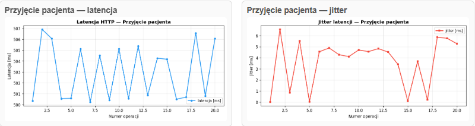
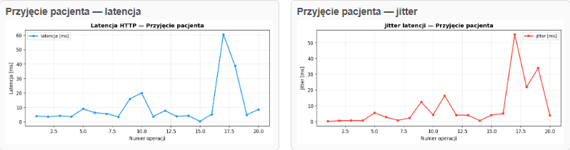
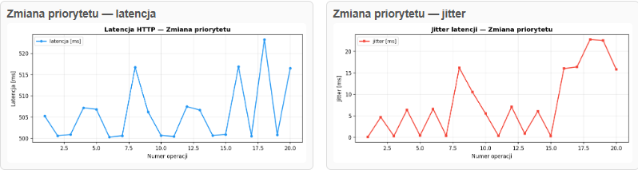
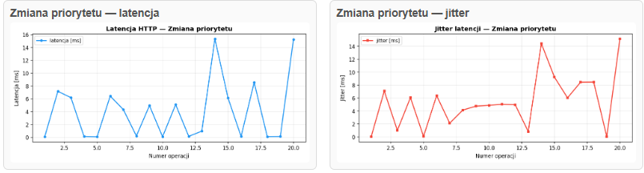

# System-kolejkowania-pacjentow-z-priorytetami

<p align="center">
  
  &nbsp;&nbsp;&nbsp;
  
</p>


---
| | |
|---|---|
| **Przedmiot** | RAIM – Rozwój aplikacji internetowych w medycynie (2025/2026) |
| **Temat** | Temat 2 – System kolejkowania pacjentów z priorytetami |
| **Etap** | Etap 3 – Współbieżność i analiza błędów |
| **Rok studiów** | 3|
| **Prowadzący** | dr inż. Anna Jezierska |
| **Autorzy** | Adam Sikorsi, Mateusz Grochowalski |
| **Uczelnia** | Politechnika Gdańska, Wydział ETI |
| **Katedra** | Katedra Inżynierii Biomedycznej (KIB) |

---

## Spis treści

1. [Analiza potrzeb i wymagań klinicznych](#1-analiza-potrzeb-i-wymagań-klinicznych)
2. [Projekt architektury systemu](#2-projekt-architektury-systemu)
3. [Symulacja zaburzeń](#3-symulacja-zaburzeń)
4. [Instrumentacja](#4-instrumentacja)
5. [Omówienie zagadnień współbieżności (race condition)](#5-omówienie-zagadnień-współbieżności-race-condition)


---

## 1. Analiza potrzeb i wymagań klinicznych

### 1.1 Identyfikacja problemu

W środowisku szpitalnym, a sczególnie w izbach przyjęć (SOR), poradniach i oddziałach intensywnej terapii - zarządzanie kolejką pacjentów jest istotnym problemem. Tradycyjne podejście FIFO (first-in, first-out) bez uwzględnienia stanu klinicznego pacjenta może prowadzić do poważnych zagrożeń zdrowotnych: pacjent w stanie zagrożenia życia może oczekiwać za pacjentem z mniej groźną dolegliwością.

Niniejszy projekt symuluje system kolejkowania pacjentów oparty na priorytetach klinicznych, który w kolejnych etapach zostanie rozszerzony o race condition i mechanizm aging.

**Etap 1** implementuje podstawowy wariant kolejki **FIFO** za pomocą losowej generacji pacjentów (według rozkładu Poissona) i obsługi przez operatora.  
**Etap 2** Dynamiczne zmiany **priorytetów** przez wielu operatorów.  
**Etap 3** Wymuszenie race condition i implementacja mechanizmu blokady lub wersjonowania.

### 1.2 Określenie użytkowników systemu


**Pacjent** - Osoba dodawana do kolejki, dodanie do kolejki, podgląd realizacji przyjęcia.

**Operator medyczny** - Pielęgniarka/lekarz przyjmujący, przyjęcie następnego pacjenta, aktualizacja statusu.

### 1.3 Analiza ryzyk

| # | Ryzyko | Prawdopodobieństwo | Wpływ | Redukcja |
|---|--------|--------------------|-------|-----------|
| R1 | Race condition przy jednoczesnym pobieraniu pacjenta przez wielu operatorów oraz zmian priorytetu| Wysokie | Krytyczny | Mechanizm blokad|
| R2 | Starvation pacjentów z niskim priorytetem (ryzyko nieprzyjęcia) | Wysokie | Wysoki | Mechanizm aging|
| R3 | Utrata danych kolejki przy restarcie systemu | Wysokie | Wysoki | Zapis danych w SQLite |
| R4 | Błędy przy aktualizacji priorytetów| Średnie | Wysoki | Wersjonowanie rekordów|
| R5 | Przeciążenie systemu przy dużym napływie pacjentów | Niskie | Średni | Logi i monitoring|

---

## 2. Projekt architektury systemu

### Uruchamianie lokalnie przez `http://127.0.0.1:5000`
### Uruchamianie zdalnie przez `https://system-kolejkowania-pacjentow-z-xuty.onrender.com`


### 2.1 Przegląd architektury

System zbudowany jest w architekturze **klient-serwer** z komunikacją REST API:

```
┌─────────────────────────────────────────────────┐
│                    FRONTEND                     │
│              HTML + JavaScript + CSS            │
└──────────────────┬──────────────────────────────┘
                   │  REST API
┌──────────────────▼──────────────────────────────┐
│                  BACKEND (Flask/Python)         │
│                                                 │
│  ┌────────────┐   ┌──────────────────────────┐  │
│  │  Routes    │   │     QueueManager         │  │
│  │  (REST)    │──▶│  (kolejka FIFO / prio)  │   │
│  └────────────┘   └──────────┬───────────────┘  │
│                              │                  │
│  ┌───────────────────────────▼────────────────┐ │
│  │        SQLAlchemy ORM + SQLite             │ │
│  │         (pacjenci, kolejka)                │ │
│  └────────────────────────────────────────────┘ │
│                                                 │
│  ┌─────────────────────────────────────────────┐│
│  │             Logging systemowy               ││
│  └─────────────────────────────────────────────┘│
└─────────────────────────────────────────────────┘
```

### 2.2 Model danych (Etap 1)

```
Pacjent
├── id (int)
├── imię (string)
├── nazwisko (string)
├── priorytet
├── czas przybycia (datetime)
└── status


QueueEntry
├── id (int)
├── priorytet 
├── czas przybycia (datetime)
├── czas w kolejce (datetime)
└── czas przyjęcia (datetime)

```

---
## 3. Symulacja zaburzeń 


Podczas realizacji projektu napotkano dwa istotne problemy charakterystyczne dla systemów kolejkowych i współbieżnych: starvation oraz race condition. 


### 3.1 Starvation


Starvation oznacza sytuację, w której element o niższym priorytecie może być przez długi czas pomijany, ponieważ system stale preferuje elementy o priorytecie wyższym. W kontekście naszego projektu oznacza to, że pacjent o niskim priorytecie mógł oczekiwać znacznie dłużej, jeśli w kolejce nieustannie pojawiali się pacjenci pilniejsi. Zjawisko to jest dobrze znane z teorii planowania zadań w systemach operacyjnych i stanowi naturalne ryzyko w algorytmach priorytetowych.


### 3.2 Race Condition


Drugim zaobserwowanym problemem był race condition, czyli błąd współbieżności pojawiający się wtedy, gdy dwie osoby jednocześnie modyfikują te same dane. W naszym przypadku dotyczyło to równoczesnej zmiany priorytetu tego samego pacjenta przez dwóch użytkowników systemu. Przykładowo, jeśli pacjent miał ustawiony priorytet 4, jedna osoba mogła kliknąć obniżenie priorytetu, a druga jego podwyższenie. Ze względu na opóźnienie aktualizacji danych w bazie oraz brak pełnej synchronizacji widoków, system mógł chwilowo pokazać priorytet 3, a następnie przeskoczyć na 5. Tego typu zachowanie jest przykładem konfliktu współbieżnych zapisów i pokazuje, że końcowy stan danych zależał od kolejności wykonania operacji.


Opisane problemy pokazują, że projektowanie systemów kolejkowych nie ogranicza się jedynie do ustalenia zasad obsługi pacjentów, ale wymaga również uwzględnienia sprawiedliwości działania algorytmu oraz odporności na jednoczesny dostęp wielu użytkowników. W praktyce ograniczanie starvation może wymagać zastosowania mechanizmów zwiększania priorytetu wraz z czasem oczekiwania, natomiast redukcja race condition wymaga lepszej kontroli współbieżności, na przykład blokad, transakcji lub mechanizmów wykrywania konfliktów zapisu.


---

## 4. Instrumentacja


W analizie wydajności systemu instrumentacja oznacza zastosowanie dodatkowych mechanizmów rejestrujących zdarzenia oraz czasy ich występowania w trakcie działania aplikacji. Jej celem jest zebranie danych, które pozwalają mierzyć i oceniać zachowanie systemu pod względem wydajnościowym, na przykład czas obsługi operacji, czas oczekiwania lub opóźnienia komunikacyjne.


### 4.1 API latencja last

W odniesieniu do latencji instrumentacja umożliwia wyznaczenie czasu potrzebnego na realizację konkretnego działania, na przykład zapisania zmiany priorytetu pacjenta do bazy danych albo odświeżenia widoku kolejki po stronie użytkownika. Porównanie momentu rozpoczęcia i zakończenia operacji pozwala obliczyć opóźnienie, a analiza wielu takich pomiarów umożliwia ocenę wydajności całego systemu lub jego poszczególnych komponentów.

W naszym programie tuż po wejściu do endpointu zapisywany jest czas startu. Następnie wykonywana jest logika endpointu - między t0 a końcem pomiaru działają operacje backendowe, m.in.:

-próba przyjęcia pacjenta z kolejki,
-usunięcie pacjenta z patients.db,
-aktualizacje stanu.

Koniec pomiaru i obliczenie latencji.

### 4.2 API latencja avg


Średni czas obsługi żądania API (w ms), liczony z ostatnich próbek.


### 4.3 API jitter

Istotnym uzupełnieniem pomiaru latencji jest pomiar jitteru, czyli zmienności opóźnienia pomiędzy kolejnymi wykonaniami tej samej lub podobnej operacji. Jitter pokazuje, na ile stabilny czasowo jest system: nawet jeśli średnia latencja pozostaje akceptowalna, duże wahania pomiędzy kolejnymi pomiarami mogą świadczyć o niestabilności działania, przeciążeniu lub problemach ze współbieżnością. Dzięki instrumentacji możliwe jest więc nie tylko określenie średniego czasu odpowiedzi, ale także ocena, czy system działa w sposób przewidywalny i powtarzalny.

---

## 5. Omówienie zagadnień współbieżności (race condition)

### 5.1 Współbieżność

Współbieżność oznacza wykonywanie wielu operacji „w tym samym czasie” (np. przez wiele wątków lub wielu użytkowników systemu).  

W aplikacjach webowych oznacza to, że serwer może obsługiwać kilka żądań jednocześnie, które odwołują się do tych samych danych.

### 5.2 Czym jest race condition

Race condition (wyścig) występuje wtedy, gdy wynik końcowy zależy od kolejności wykonania równoległych operacji na wspólnym zasobie.  
Jeżeli nie ma poprawnej synchronizacji, dwa żądania mogą odczytać ten sam stan „przed zmianą” i zapisać kolidujące wyniki.

### 5.3 Jak race condition wygląda u nas projekcie

W projekcie występują dwa główne miejsca podatne na wyścig:

1. **Przyjęcie pacjenta**  
   Dwóch operatorów może równocześnie próbować przyjąć tego samego pierwszego pacjenta z kolejki.

2. **Zmiana priorytetu**  
   Dwóch operatorów może jednocześnie zmieniać priorytet tego samego pacjenta (np. jeden zwiększa, drugi zmniejsza).

### 5.4 Wymuszenie race condition

Do celów dydaktycznych race condition jest świadomie wzmacniany przez:
- równoległe żądania (test wielowątkowy),
- celowe opóźnienie (`time.sleep(0.5)`) w sekcjach krytycznych przy wyłączonej ochronie. Celowo poszerza okno krytyczne między odczytem a zapisem, więc drugi request ma większą szansę „wejść w środek” operacji.

Dzięki temu łatwo odtworzyć konflikt i obserwować jego skutki w API i metrykach.

### 5.5 Mechanizm blokady / wersjonowania

W projekcie zastosowano dwa podejścia:

- **Blokada (lock)**  
  Przy włączonej ochronie operacje wykonywane są w sekcji krytycznej, co serializuje dostęp (operacje nie idą jednocześnie, tylko jedna po drugiej) do kolejki i ogranicza konflikty.

- **Cooldown po zmianie priorytetu (2 sekundy, przy włączonej ochronie)**  
  Po udanej zmianie priorytetu system chwilowo blokuje kolejną zmianę tego samego rekordu.  
  To celowy mechanizm ograniczający „przepychanie” jednego pacjenta przez wielu operatorów w tej samej chwili.  
  Odpowiedź z API dla takiej blokady to **429** (cooldown/rate-limit), co **nie jest race condition**.

- **Wykrywanie konfliktu zapisu (wariant wersjonowania logicznego, tryb bez ochrony)**  
  Ten mechanizm jest używany przede wszystkim w trybie **bez blokady** (gdy celowo dopuszczamy współbieżny zapis dla demonstracji race condition).  
  Dla zmiany priorytetu wykorzystywany jest znacznik ostatniego autora (`_last_writer`) oraz porównanie stanu przed/po (`old_priority` vs bieżący `priority`).  
  Jeśli w międzyczasie inny operator zmieni rekord, backend zwraca `"conflict"`, a endpoint mapuje to na HTTP `409`.


### 5.6 Porównanie przed i po poprawce (test)

Do porównania używany jest skrypt `test.py`, który:
- loguje dwóch użytkowników,
- uruchamia równoczesne żądania w rundach (`admit` albo `priority`),
- zbiera statusy odpowiedzi (`200`, `409`, `429`) i podsumowanie.  
  `200` - żądanie zostało obsłużone poprawnie przez API.  
  `409` - Conflict (konflikt współbieżności, race condition).  
  `429` - cooldown/rate-limit po zmianie priorytetu (mechanizm ochronny, **nie** race condition).

Interpretacja wyników:
- **Przed poprawką / przy wyłączonej ochronie**: częstsze konflikty i niestabilność wyniku (więcej sytuacji wyścigu).

**Przyjęcie pacjenta:**

Wyniki: tryb=admit, wątki=2 

Łączna liczba rund:             10  
Wszyscy 200:       0  ← wyścig niezauważony  
Przynajmniej jeden 409:            10  ← wykryty wyścig  

**Zmiana priorytetu:**

Wyniki: tryb=priority, wątki=2  

Łączna liczba rund:              10  
Wszyscy 200:      1  ← wyścig niezauważony  
Przynajmniej jeden 409:            9  ← wykryty wyścig  

- **Po poprawce / przy włączonej ochronie**: stabilniejszy, deterministyczny przebieg operacji (mniej konfliktów logicznych).

**Przyjęcie pacjenta:**

Wyniki: tryb=admit, wątki=2

Łączna liczba rund:              10  
Wszyscy 200:     10  ← wyścig niezauważony  
Przynajmniej jeden 409:            0  ← wykryty wyścig  
  
**Zmiana priorytetu:**

Wyniki: tryb=priority, wątki=2

Łączna liczba rund:              10  
Wszyscy 200:     10  ← wyścig niezauważony  
Przynajmniej jeden 409:            0  ← wykryty wyścig  

- Dodatkowo w UI aktualizowane są metryki latencji/jitteru dla `admit` i `priority` oraz licznik `Race condition`, co pozwala obserwować efekt zmian na żywo.


**Wykresy:**

Przyjęcie pacjenta bez ochrony:

<p align="center">
  
</p>

Przyjęcie pacjenta z ochroną:

<p align="center">
  
</p>

Zmiana priorytetu bez ochrony:

<p align="center">
  
</p>

Zmiana priorytetu z ochroną:

<p align="center">
  
</p>

---

## 6. Analiza Fairness i Mechanizm Aging

### 6.1 Fairness w Systemie Kolejkowania

Fairness (sprawiedliwość) w systemie kolejkowania definiuje się jako równomierne traktowanie pacjentów przy podejmowaniu decyzji o obsłudze. W kontekście medycznym oznacza to:

- **Sprawiedliwość kliniczna**: pacjent krytyczny (priorytet 5 — czerwony) musi być obsłużony przed pacjentem stabilnym (priorytet 1 — niebieski)
- **Niedyskryminacja**: pacjenci tego samego poziomu priorytetu mają podobne szanse na przyjęcie
- **Przejrzystość**: reguły kolejkowania są jasne dla personelu medycznego

System implementuje **5-poziomową hierarchię priorytetów**, co zapewnia sprawiedliwość kliniczną, ale stwarza teoretyczne zagrożenie **starvation** dla pacjentów niskiego priorytetu.

### 6.2 Problem Starvation — Teoretyczne Nieobsłużenie Pacjentów

**Starvation** to sytuacja w teorii szeregowania zadań, w której proces (pacjent) o niskim priorytecie nigdy nie otrzyma dostępu do zasobu (obsługi) z powodu ciągłej dominacji procesów o wyższych priorytetach.

**Matematycznie**: jeśli intensywność ruchu ρ(high_priority) > 1, to pacjenci niskiego priorytetu mogą czekać nieskończenie długo.

#### Przykład Scenariusza Starvation

```
Pacjent niebieski (priorytet 1) przychodzi o 10:00
Przez 2 godziny przychodzą TYLKO pacjenci czerwoni/pomarańczowi
Pacjent czeka → czeka → czeka...
Teoretycznie: nigdy się nie dojdzie do obsługi!
```

#### Status w Projekcie

Jest to **teoretyczne zagrożenie**, uwzględnione w analizie ryzyk projektu jako **R2 (wysokie ryzyko, wysoki wpływ)**, ale w praktyce:

- System medyczny ma ograniczoną liczbę pacjentów krytycznych
- W rzeczywistości: pacjent czeka, ale ostatecznie zostaje obsłużony
- Aging to **rozwiązanie teoretyczne** na wypadek systemów o bardzo wysokiej dynamice priorytetów

### 6.3 Mechanizm Aging — Teoretyczne Rozwiązanie Starvation

**Aging** to algorytmiczna technika, która dynamicznie podnosi priorytet procesu (pacjenta) w funkcji czasu oczekiwania w kolejce.

Istnieje kilka wariantów funkcji aging, może być np. liniowy, logarytmiczny oraz wykładniczy.

#### Trzy Warianty Aging

**1. Linear Aging** (najczęściej stosowana w systemach medycznych)

**Przykład**:

```
Pacjent niebieski (priorytet 1) z linear aging:
- t=0s:    P = 1.0
- t=50s:   P = 1.5
- t=100s:  P = 2.0 (automatycznie "piął się" do zielonego)
- t=300s:  P = 4.0 (po 5 minutach czekania)
- t=400s:  P = 5.0 (staje się krytycznym — "ostatnia szansa")
```

**Zalety**:
- Proste do zrozumienia i implementacji
- Liniowy wzrost = przewidywalny dla personelu
- Standard w systemach medycznych 

---

**2. Logarytmiczny Aging** 

**Charakterystyka**:
- Wolniej rosnący priorytet
- Początkowo mały efekt, potem rośnie
- Bardziej sprawiedliwe dla pacjentów wysokiego priorytetu

**Przykład**:

```
t=10s:   P = 1 + 0.5·ln(10)   ≈ 1.15  
t=100s:  P = 1 + 0.5·ln(100)  ≈ 2.30  
t=1000s: P = 1 + 0.5·ln(1000) ≈ 3.45  
```

---

**3. Wykładniczy Aging**

**Charakterystyka**:
- Szybko rosnący priorytet 
- Mały wpływ na początku, potem drastyczny skok
- Może być niesprawiedliwe dla nowych pacjentów krytycznych

**Przykład**:

```
t=10s:  P = 1 · 1.05^10  ≈ 1.63
t=50s:  P = 1 · 1.05^50  ≈ 11.5 
```

---

#### Porównanie Strategii

| Strategia | Predykcyjność | Sprawiedliwość | Złożoność | Medycyna |
|-----------|--|--|--|--|
| Linear | Wysoka ✓ | Wysoka ✓ | Niska ✓ | Standard ✓ |
| Logarytmiczna | Średnia | Średnia | Średnia | Rzadko |
| Wykładnicza | Niska | Niska | Wysoka | Nie stosuje się |

### 6.4 Analiza Teoretyczna — Kiedy Aging Jest Potrzebny?

#### Warunki Zagrożenia Starvation

Starvation występuje wtedy, gdy:

1. **Wysokie tempo przybycia pacjentów wysokiego priorytetu**

```
λ(priorytet=5) + λ(priorytet=4) > μ (Service Rate)

Czyli: pacjenci krytyczni przychodzą szybciej niż można ich obsługiwać
```

2. **Długie czasy oczekiwania pacjentów niskiego priorytetu**

```
W(priorytet=1) → ∞ (czekają nieskończenie długo)
```

3. **Brak mechanizmu dynamicznego podnoszenia priorytetu**

```
P(t) = const (priorytet nie zmienia się z czasem)
```

### 6.6 Teoretyczne Implikacje dla Systemu

#### Plusy Wdrożenia Aging

-  Gwarancja: każdy pacjent ostatecznie zostanie obsłużony
-  Sprawiedliwość: nie ma "zagubnionych" pacjentów
-  Psychologiczny: pacjent widzi, że jego priorytet rośnie

#### Minusy Wdrożenia Aging

-  Wszyscy pacjenci ostatecznie otrzymują wysokie priorytety 
-  Dodatkowa złożoność: trzeba przeliczać co sekundę
-  Dodatkowe opóźnienie w sortowaniu

---

## 7. Analiza Kompromisów Implementacyjnych

### 7.1 Analiza Decyzji: Latencja vs. Spójność Danych

#### Problem: Race Condition przy Zmianie Priorytetu

Dwóch operatorów zmienia priorytet tego samego pacjenta jednocześnie:

```
Operator A: zmienia priorytet 3 → 4 
Operator B: zmienia priorytet 3 → 2 

BEZ OCHRONY (brak lock):
├─ t=0.00: Obaj czytają: priority=3
├─ t=0.50: A zapisuje: priority=4
├─ t=0.50: B zapisuje: priority=2 ← KONFLIKT!
└─ Wynik: priority=2

Z OCHRONĄ (lock):
├─ t=0.00: A wchodzi w sekcję krytyczną
├─ t=0.05: A czyta priority=3, zmienia na 4
├─ t=0.05: B czeka na lock...
├─ t=0.10: A wychodzi z sekcji, zwalnia lock
├─ t=0.10: B wchodzi w sekcję krytyczną
├─ t=0.15: B czyta priority=4, zmienia na 3
└─ Wynik: priority=3 (oba zapisy były atomowe)
```

#### Analiza Kompromisu

| Aspekt | Bez Ochrony | Z Ochroną (Lock) |
|--------|-------------|-----------------|
| **Latencja API** | 1-5ms | 501-555ms |
| **Spójność danych** | NISKA (race condition) | WYSOKA  |
| **Przepustowość** | Wysoka (równoległy dostęp) | Niska (serializacja) |
| **Bezpieczeństwo kliniczne** |  RYZYKO |  BEZPIECZNE |

W systemach medycznych **bezpieczeństwo >> wydajność**. Dodatkowe 500-550 ms latencji to akceptowalna cena za gwarancję spójności danych pacjentów.

### 7.2 Analiza Decyzji: Wydajność vs. Bezpieczeństwo Operacyjne

#### Problem: Zmiana Priorytetu w Szybkiej Sekwencji

```
t=0.0s:   Operator A zmienia priority 3→4
t=0.5s:   Operator B chce zmienić 3→2 → COOLDOWN! 
t=2.0s:   Cooldown mija, B może zmienić
```


#### Parametry Cooldown

| Wartość | Ocena |
|---------|-------|
| <1s |  Zbyt niska — operatorzy mogą "walczyć" o pacjenta |
| 1-3s |  OPTYMALNA — dość czasu na decyzję |
| >5s |  Zbyt wysoka — frustracja personelu medycznego |

**Werdykt**: ✓ **2 sekundy to rozsądny kompromis**

Operatorzy czasem dostają HTTP 429, ale system zapobiega przypadkowemu "przepychaniu" tego samego pacjenta przez wielu użytkowników.

**WAŻNE**: Cooldown (429) to **NIE race condition** (409). To celowy mechanizm ochronny na poziomie aplikacji.

### 7.3 Fairness a kompromisy implementacyjne

#### Opóźnienia a spójność danych

Aging w tle wprowadza **okno niespójności**: między momentem, kiedy pacjent „zasługuje" na wyższy priorytet, a momentem aktualizacji bazy upływa dany czas. W tym oknie operator może podjąć decyzję na podstawie nieaktualnego priorytetu. Jest to kompromis między **spójnością natychmiastową** a **przewidywalnością stanu bazy**. W kontekście SOR opóźnienie agingu o 5 minut jest klinicznie akceptowalne dla priorytetów 1–3. Dla priorytetów 4–5 (pacjenci krytyczni) aging nie powinien w ogóle zmieniać priorytetu.

#### Wydajność a bezpieczeństwo

Lock z Etapu 3 serializuje operacje na kolejce — gwarantuje spójność, ale zmniejsza przepustowość. Aging dodaje kolejny typ zapisu do bazy chroniony tym samym lockiem. Przy częstym agingu i dużej kolejce lock może stać się problematyczny. **Kompromis:** wydłużyć interwał agingu kosztem nieco wolniejszego wzrostu efektywnego priorytetu.

#### Fairness a priorytetyzacja kliniczna

Jeśli zbyt agresywnie podnosimy priorytet pacjentów niskiego priorytetu, tracimy właściwość, dla której system powstał — szybką obsługę stanów zagrożenia życia. **Idealny system balansuje** między fairness a clinical urgency (stan zagrożenia zawsze wychodzi na przód).

## 8. Które Kompromisy Są Dopuszczalne?

### 8.1 Macierz Akceptowalności

```
REGUŁA OGÓLNA:
┌─────────────────────────────────────────────┐
│ Bezpieczeństwo medyczne = NIEZMIENNIE WAŻNE        │
│ Wydajność = Optymalizujemy w drugiej kolejności│
└─────────────────────────────────────────────┘
```

### 8.2 Szczegółowa Ocena

| Kompromis | Akceptowalny | Uzasadnienie |
|-----------|-------------|-------------|
| +500ms latencji dla spójności danych |  **TAK** | Bezpieczeństwo > wydajność |
| Cooldown 2s dla zapobiegu konfliktom |  **TAK** | Ochrona operacyjna uzasadniona |
| Sleep(0.5) w testach |  **TAK** | Edukacyjne |
| **BRAK mechanizmu aging** | **NIE** | Ryzyko starvation pacjentów |
| Brak wersjonowania danych | **OSTROŻNIE** | SQLite + lock są wystarczające dla celów edukacyjnych |

---

## 9. Wnioski

Analiza fairness i mechanizm aging ujawniają fundamentalny dylemat systemów kolejkowania priorytetowego: **optymalizacja pod kątem pilności jest w naturalnym konflikcie z gwarancją obsługi**. W informatyce problem ten jest znany od dekad i nie ma jednego rozwiązania — każda implementacja jest kompromisem.

W kontekście projektu:

- System bez agingu jest **wydajny, ale niesprawiedliwy** — poprawnie priorytetyzuje stany krytyczne, ale może bezterminowo blokować pacjentów niskiego priorytetu,
- Aging liniowy z interwałem 5 min zapewnia **górne ograniczenie czasu oczekiwania**, eliminując starvation,
- Implementacja agingu wymaga rozszerzenia mechanizmów współbieżności z Etapu 3,

> **Starvation w systemie medycznym nie jest dopuszczalnym kompromisem — jest błędem projektowym.** Aging nie jest opcjonalnym ulepszeniem, lecz wymaganiem bezpieczeństwa każdego systemu kolejkowania priorytetowego w środowisku klinicznym.
